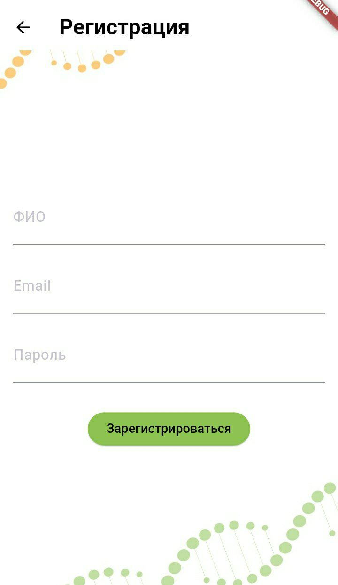
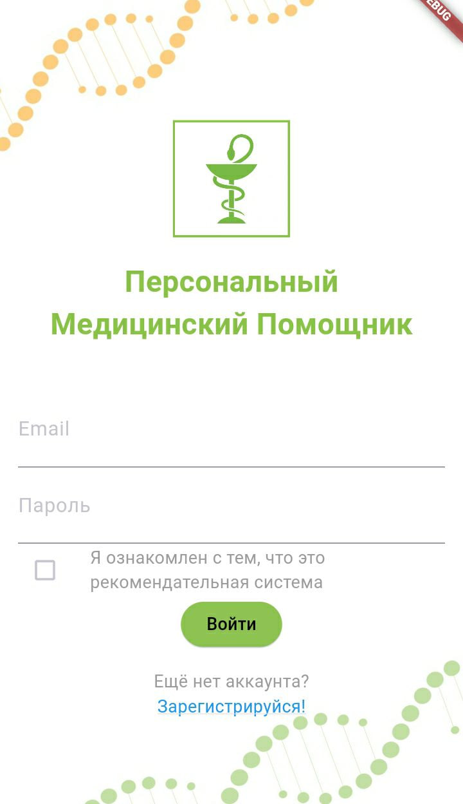
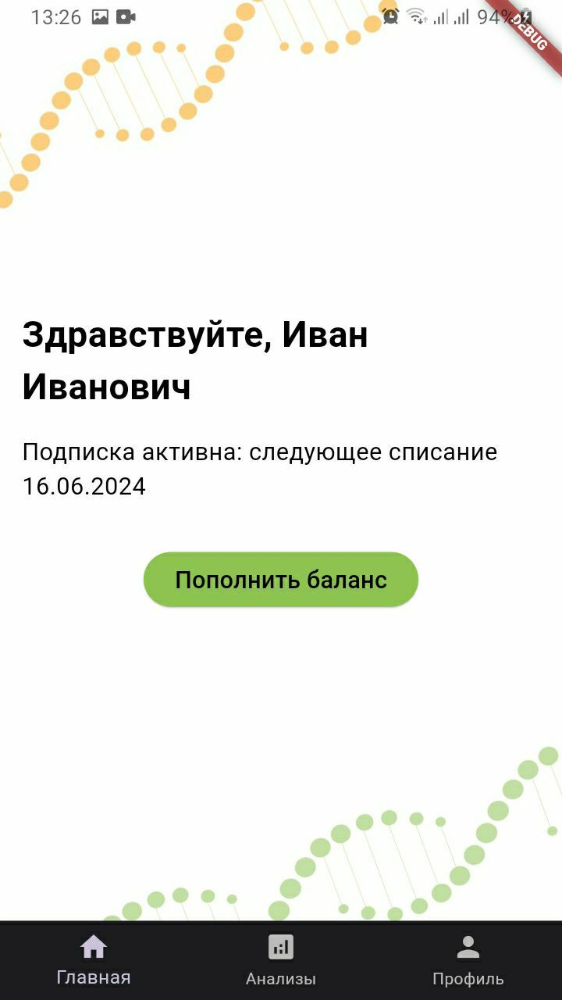
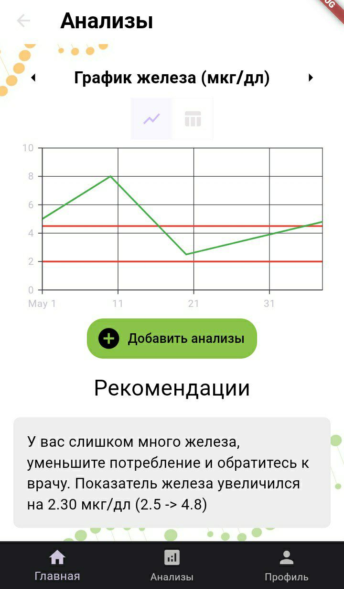
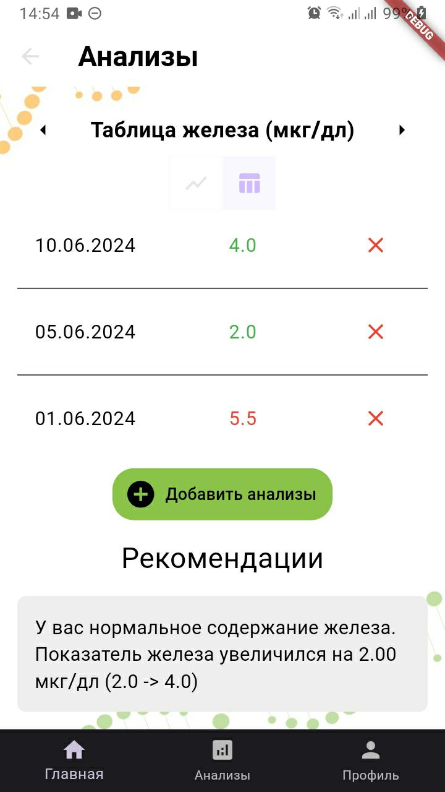

# Med Helper

Мобильное приложение для отслеживания медицинских показателей с персонализированными рекомендациями.

## 📌 Основные функции
- 📊 Визуализация анализов (графики/таблицы)
- 🔍 Анализ динамики показателей
- 💡 Автоматические рекомендации при отклонениях
- ➕ Добавление новых анализов
- 🔐 Система авторизации пользователей

## 🛠 Технологии
- **Flutter** (кроссплатформенная разработка)
- **Dart** (основной язык)
- **SQLite** (локальное хранение данных)
- **Syncfusion Flutter Charts** (визуализация данных)

## 🖼 Скриншоты
| Регистрация | Авторизация | Главная |
|-------------|-------------|---------|
|  |  |  |

| Анализы (график) | Анализы (таблица) | Добавление |
|------------------|-------------------|------------|
|  |  |  |

## 🏗 Архитектура
Приложение разделено на модули:
1. **Авторизация/регистрация** (валидация, работа с SQLite)
2. **Главная страница** (информация о подписке)
3. **Анализы** (графики, таблицы, рекомендации)
4. **Добавление данных** (формы ввода)
5. **Профиль** (личные данные)